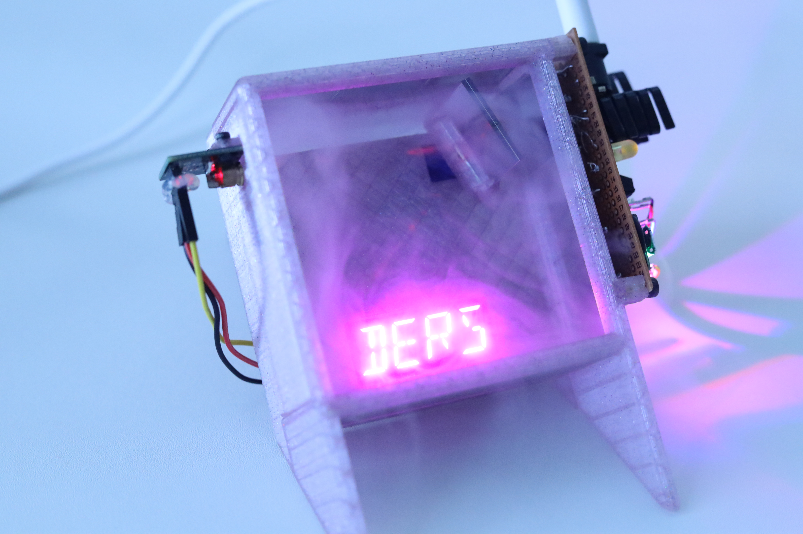

# 🌫️ Paralysis

    Write your project content here. This content will be used in both the README 
and Jekyll post. You can use **markdown** formatting.

## Project Overview
Describe your project in detail...

## Process
Document your creative/technical process...

## Technical Details
### Software
- [List key software components]

### Hardware
- [List key hardware components]

## Documentation
### Build Process
[Document the build process]

### Installation
[Installation instructions if applicable]

### Usage
[Usage instructions]

    ## Media
    
### Images

### Videos
- [paralysis](media/videos/paralysis.webm)

### 3D Models
- [paralysis](media/models/paralysis.glb)
